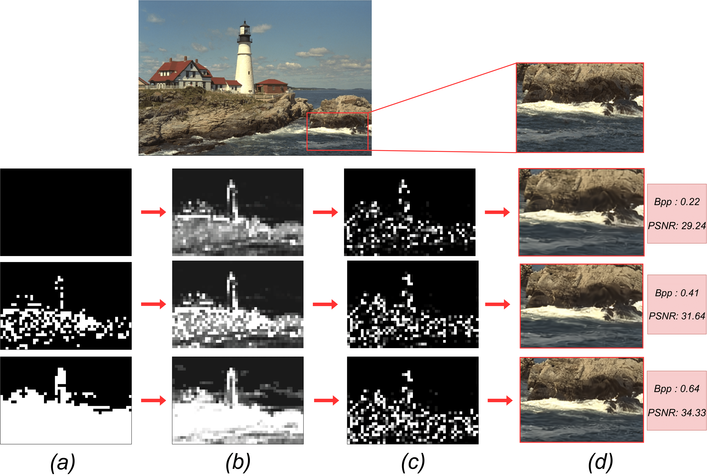

# Efficient Progressive Image Compression with Variance-aware Masking


Pytorch implementation of the paper "**Efficient Progressive Image Compression with Variance-aware Masking**", accepted at WACV 2025. This repository is based on [CompressAI](https://github.com/InterDigitalInc/CompressAI) and [STF](https://github.com/Googolxx/STF)


<div align="center">

<p><em>Compression results for three different qualities, which increase across rows.
  Adding details via the masking system (a) increases the standard deviation in the non-masked latent representation (b)  to add  details  (c) for a better reconstruction (d).</em></p>
</div>

## Abstract
Learned progressive image compression is gaining momentum as it allows improved image reconstruction as more bits are decoded at the receiver. We propose a progressive
image compression method in which an image is first represented as a pair of base-quality and top-quality latent representations. Next, a residual latent representation is encoded as the element-wise difference between the top and base representations. Our scheme enables progressive image compression with element-wise granularity by introducing a masking system that ranks each element of the residual latent representation from most to least important, dividing
it into complementary components, which can be transmitted separately to the decoder in order to obtain different
reconstruction quality. The masking system does not addfurther parameters nor complexity. At the receiver, any elements of the top latent representation excluded from the transmitted components can be independently replaced with the mean predicted by the hyperprior architecture, ensuring reliable reconstructions at any intermediate quality level. We also introduced Rate Enhancement Modules (REMs), which refine the estimation of entropy parameters using already decoded components. We obtain results competitive with state-of-the-art competitors, while significantly reducing computational complexity, decoding time, and number of parameters.


## Usage

### Environment
- conda env create -f environment.yml
- conda activate pic 

## Train - Step 1: training from scratch

```
cd src 

python train.py  \
--multiple_hyperprior \
--multiple_decoder \
--all_scalable \
--delta_encode \
--training_type first_train \
--support_progressive_slices 5 \
--total_mu_rep
--save_path  # folder where to save checkpoints
--code  # name of the folder where the checkpoints will be stored in /save_path/
```


## Train -Step 2: fine-tune the decoder
```
cd src 

python train.py \
--training_type refine_gs \
--checkpoint #path-for-the-checkpoint \
--total_mu_rep \
--lrp \
--epochs 80 \
--patience 12 \
--sampling_training  \
--test_before \
--model pic

```

## Train - Step 3: train the rems 
```
cd src 

python train.py \
--training_type rems
--checkpoint #path-for-the-checkpoint \
--epochs 80 \
--patience 12 \
--sampling_training  \
--test_before \
--check_levels 0.05 0.75 2 \
--check_levels_np 100 100 100 #number of sampling points for each subrange
--mu_std \
--dimension middle \
--model rem
```

## Validate

TODO